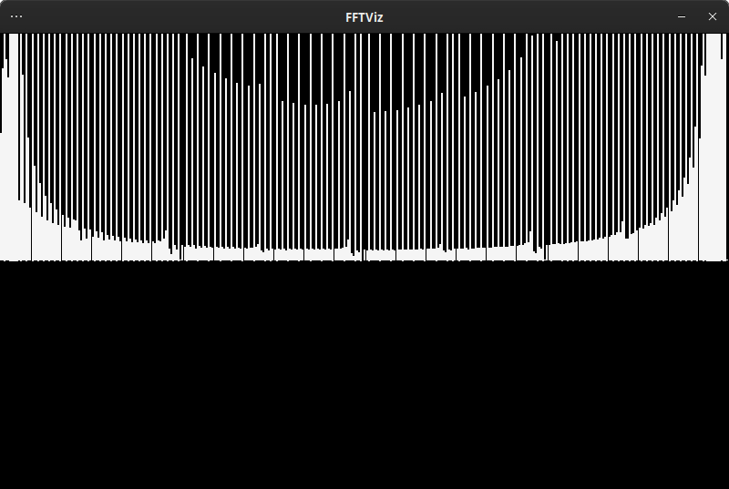

# FFTViz

Fast Fourier Transform and its visulisation using raylib. It takes audio samples from one of the files
in the `audio` folder and draws its spectrum for every frame. 

# Build
` $./build.sh`

`$./fft`
